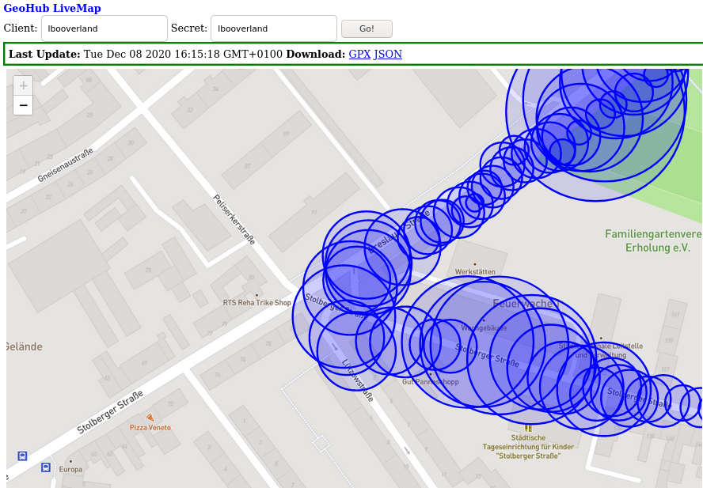
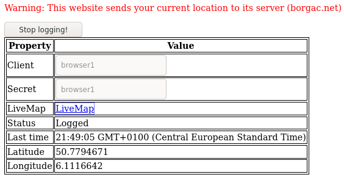

# `geohub`

## What is GeoHub?

GeoHub is -- in fancy terms -- a framework for real time geographic
applications. It currently allows for

* Ingesting geographic points, for example GPS positions, via HTTP API.
* Exporting geographic points as GeoJSON (GPX soon to come).
* Efficiently listening to position updates (new points) in real time via HTTP
API.
* Privacy first by protecting every point with a password (session token).

## API description

Important concepts are:

* A **Client** is for example someone walking around with their phone, or a
moving car. A client sends geographic updates to the server. The `client`
appears as URL component after `/geo/`.
* A **Secret** is an alphanumeric string (a-zA-Z0-9 only) attached to every
point. Anyone wanting to retrieve a given point needs to know its secret. You
can also log points without secret. In that case, everyone can see them
(including clients asking for points with a secret). The `secret` is supplied as
URL parameter `&secret=`.
* Every point has a unique integer **ID**. It can be used to limit which points
to fetch, for example when refreshing or waiting on updates. Think of it as a
very fine-grained page token.

*Scenario*: You go for a walk, configuring your phone to send live updates to a
GeoHub instance. You want to share it with a friend who is not supposed to know
about where you were yesterday. You can leave your `client` string the same and
use a new `secret` that you give to your friend; they can now only see points
logged with this secret.

* `POST` `/geo/<client>/log?lat=<latitude>&longitude=<longitude>&time=<time>&s=<speed>&ele=<elevation>&secret=<secret>`
  * Log a new point.
  * `client`, `secret`: See above.
  * `latitude`, `longitude`: Geographical position, in decimal degrees (note:
      may be extended later). **Required**.
  * `time`: ISO 8601 time. If left out, current server time is used. Example:
  `2020-12-03T15:42:40.010325Z`. **Optional**.
  * `speed`: Speed in km/h (usually). If you decide to always use m/s, you are
  free to do so. **Optional**.
  * `elevation`: Elevation in meters. **Optional**.
  * `accuracy`: Accuracy in meters. **Optional**
  * `unit`: If given, convert the number given for `&s=` into `km/h` for
  storage, assuming the given unit. Can be: kn/knots, mph, mps/ms/'m/s', kmh/'km/h'/kph.
  * A body -- if present and encoded in whatever content-type -- is attached as `note` to the
  point and returned as property `note` of GeoJSON points later.
  * Usually returns code **200** except for server errors (500) or malformed inputs (400).
* `POST` `/geo/<client>/logjson?secret=<secret>` with body: `application/json`.
  * Log one or more new points.
  * `client` and `secret` have the semantics described above.
  * The body is expected to be a JSON document structured like the following
  example -- a single field `locations` containing a list of GeoJSON `Feature`s.

```json
{
  "locations": [
  {
    "type": "Feature",
      "geometry": {
        "type": "Point",
        "coordinates": [
          -122.030581,
        37.331800
        ]
      },
      "properties": {
        "timestamp": "2015-10-01T08:00:00-0700",
        "altitude": 0,
        "speed": 4,
        "horizontal_accuracy": 30,
      }
  },
  ]
}
```

* `GET` `/geo/assets/...`
  * Static file serving. The `assets` directory should be deployed in the
  current working directory from which the server is run.
* `GET` `/geo/<client>/retrieve/json?secret=<secret>&from=<from_timestamp>&to=<to_timestamp>&limit=<maximum
number of entries returned>&last=<id of last known entry>`
  * Fetch geo data as GeoJSON object. Returns oldest point first within the
  returned `GeoJSON` object.
  * `from`, `to`: Timestamp range. For best results, supply ISO 8601 timestamps,
  but `YYYY-mm-dd hh:mm:ss.sss` is also accepted. (GeoHub tries to be flexible
  about this, and may become better over time).
  * `limit`: Return at most this number of entries, starting with the oldest
  entries.
  * `last`: This is a sort of page token, identifying the most recent entry you
  know. GeoHub will only return events newer than this. The IDs used here are
  returned as property `id` in the GeoJSON `Feature`s.
  * Returns a GeoJSON object.
* `GET` `/geo/<client>/retrieve/gpx?secret=<secret>&from=<from_timestamp>&to=<to_timestamp>&limit=<maximum
number of entries returned>&last=<id of last known entry>`
  * Fetch geo data as GPX document (`application/gpx+xml`).
  * This endpoint has the same parameters as the `retrieve/json` endpoint. It
  returns a GPX document containing one Track consisting of one Track Segment.
  The GPX version is 1.0.
* `GET` `/geo/<client>/retrieve/last?secret=<secret>&last=<last ID>&limit=<max
entries>`
  * Fetch most recent points for the `client`. See `/geo/<client>/retrieve/json`
  above for descriptions of the other parameters. As opposed to `retrieve/json`,
  the returned points are guaranteed to be ordered by time with the newest point
  first (as makes sense for some use cases), and wrapped inside a `GeoHubUpdate`
  object containing additional information. This makes the returned value
  identically structured to that of `retrieve/live` below.
  * Returns a `LiveUpdate` object. `last` is the most-recent ID of all points:

```json
{
  "type": "GeoHubUpdate",
  "last": 1205,
  "error": "error string if applicable",
  "geo": {
    "type": "FeatureCollection",
    "features": [
      {
        "type": "Feature",
        "properties": {
          "time": "2020-12-03T15:42:40.010325Z",
          "altitude": 40,
          "speed": 22,
          "id": 1205,
          "accuracy": 12.5,
          "note": "A happy little note",
        },
        "geometry": {
          "type": "Point",
          "coordinates": [
            6.09,
            50.795
          ]
        }
      },
    ...
    ]
  }
}
```

* `GET` `/geo/<client>/retrieve/live?secret=<secret>&timeout=<timeout in sec>`
  * Wait at most `timeout` seconds for events from `client` with the given
  `secret`. This is a "hanging" request endpoint, returning after `timeout`
  seconds or any time that a new point has been logged. This is useful for
  real-time applications, such as the live map (in `assets/`).
  * This API returns data compatible with `/geo/<client>/retrieve/last`. Think
  of the two endpoints as complementary, one retrieving recent and this one
  returning current events.
  * Note: As opposed to other endpoints, this endpoint doesn't return points
  with lacking secret ("public" points).
  * This endpoint returns at most one point at a time.
  * If no new point has arrived in time, a `LiveUpdate` with `null` entries for
  `geo` and `last` is returned.

## Installation

Installing GeoHub is quite easy. You need

* a PostgreSQL server
* (optional) a reverse proxy in front

1. Set up a database with the supplied `pgsql_schema.sql`. It will install the
   elements into the `geohub` schema. Currently, this is a very small schema.
   Make sure that the `pgcrypto` extension is enabled in your database.
   `PostGIS` is not required.
1. Configure the database connection in `Rocket.toml`. Rocket.rs usually
   connects to PostgreSQL via localhost/::1, so make sure that this is allowed
   by modifying `pg_hba.conf` if needed.
1. If you want TLS or already have a server on port 80/443, configure your main
   webserver to proxy to GeoHub. For example, in nginx you can achieve this very
   easily:

```
# Put this in an existing server { } block.

    # Geohub
    #
    # This will strip the /geo/ prefix, so add it back below. Adapt to your
    # preferred URL scheme.
    location /geo/ {
        proxy_pass http://127.0.0.1:8000/geo/;
    }
```

Finally, make a copy of `Rocket.toml.example` to `Rocket.toml`, adapt for your
needs, and run `cargo run --release`.

## Usage


*Map data © OpenStreetMap contributors, CC-BY-SA, Imagery © MapBox*

The `assets/` directory contains web applications directly built on top of
GeoHub with nothing more than Ajax and some third-party libraries.

This also allows you to immediately use the `livemap` app at
`https://yourhost.com/geo/assets/livemap.html`, which consists of a single HTML
page, a CSS file, and the leaflet.js library (which is included). - latter is
(c) 2010-2019 Vladimir Agafonkin, (c) 2010-2011 CloudMade.

It displays live location data as it is ingested, in real time.

## Ingestion

### From Android phones

If you want to go on a difficult hike (though one with nice mobile data
coverage) and keep your worried parents up to date, do this:

1. Install the [`GPSLogger` app](https://github.com/mendhak/gpslogger). It is
   one of only few apps I know of that has the features required to work with
   GeoHub.
1. Configure the *Custom URL* feature to your URL. By default, you only
   (optionally) need to add a secret and of course your host and URL part. See
   the API documentation above: GPSLogger works with the `/geo/<client>/log`
   endpoint.
1. Start logging, and pass the appropriate link to the livemap
   (`https://yourhost.com/geo/assets/livemap.html?client=<yourclient>&secret=verysecret`)
   to any concerned relatives. If you configure GPSLogger to log every few
   seconds, it will work best. Latency between a point reaching your server and
   the live map being updated will generally be way less than half a second.

See also the `examples/` directory for more ways to use GeoHub. For example,
stream metadata from German long distance trains to GeoHub.

Alternatively, Overland ([iOS](https://github.com/aaronpk/Overland-iOS),
[Android](https://github.com/OpenHumans/Overland_android)) is also able to send
data to GeoHub. As it uses a different API, use a URL like
`https://yourhost.com/geo/<yourclient>/logjson?secret=<yoursecret>`. This is the
batch API, as Overland sends batches of points.

### From the web



*The TrackMe "UI", allowing ingestion of browser-supplied location from any
device running a web browser.*

The `assets/trackme.html` site contains a simple script to regularly send your
browser location (only when changed) to the GeoHub instance serving it.

If your GeoHub is running, you can simply use it by going to
`https://your.geohub.com/geo/assets/trackme.html?client=YOURCLIENT&secret=YOURSECRET`.

Click the start button to start sending locations to GeoHub. Of course the
browser will ask for permission before allowing access to you location.

